# Uni-con 🏠

<div align="center">
  <table style="border: none;">
    <tr>
      <td align="center" style="vertical-align: middle; padding-right: 20px;">
        
      </td>
      <td align="center" style="vertical-align: middle; padding-left: 20px;">
        
      </td>
    </tr>
  </table>
  <h3>청년을 위한 스마트 방 찾기 & 룸메이트 매칭 플랫폼</h3>
  <p>저장된 성향을 바탕으로 나와 딱 맞는 룸메이트를 추천해드려요!</p>
</div>

<div align="center">
  <h4>📱 앱 미리보기</h4>
  
  <!-- 앱 스크린샷 슬라이드 -->
  <table>
    <tr>
      <td align="center">
        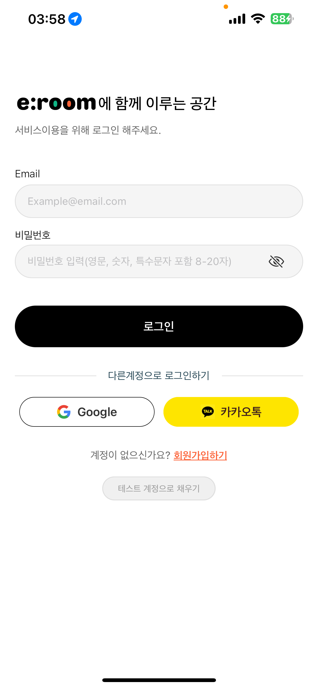
        <br/>
        <sub>로그인 화면</sub>
      </td>
      <td align="center">
        
        <br/>
        <sub>메인 화면</sub>
      </td>
      <td align="center">
        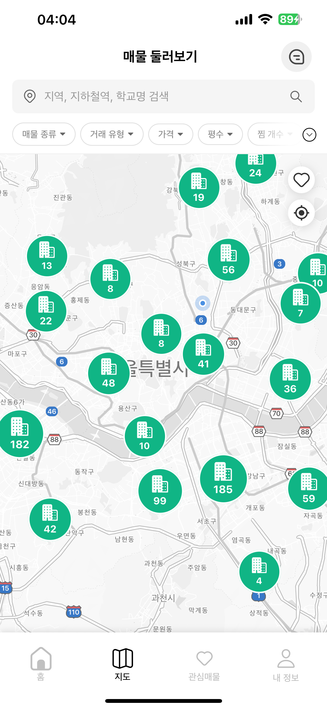
        <br/>
        <sub>지도 검색</sub>
      </td>
    </tr>
    <tr>
      <td align="center">
        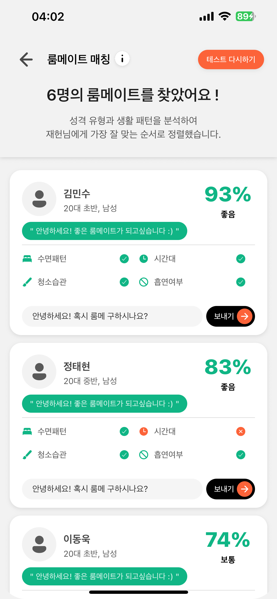
        <br/>
        <sub>룸메이트 매칭</sub>
      </td>
      <td align="center">
        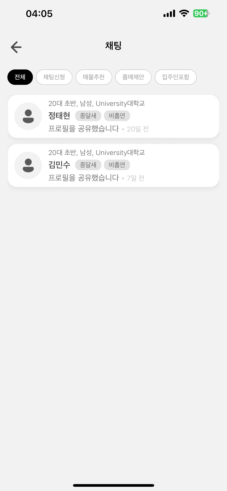
        <br/>
        <sub>실시간 채팅</sub>
      </td>
      <td align="center">
        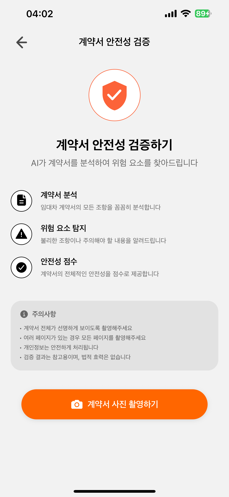
        <br/>
        <sub>계약서 분석</sub>
      </td>
    </tr>
  </table>

  <!-- 라이브 데모 링크 -->
  <p>
    <a href="https://expo.dev/@your-username/uni-con">
      
    </a>
    <a href="https://uni-con-web.vercel.app">
      
    </a>
  </p>

  <!-- QR 코드 -->
  <details>
    <summary>📱 <strong>모바일에서 바로 체험하기</strong></summary>
    <br/>
    
    <p><em>Expo Go 앱으로 QR 코드를 스캔하세요</em></p>
  </details>

  <!-- 앱 데모 비디오 -->
  <details>
    <summary>🎥 <strong>앱 사용법 영상보기</strong></summary>
    <br/>
    
    <p><em>실제 앱 사용 모습</em></p>
  </details>

</div>

## 📱 주요 기능

### 🏡 스마트 매물 검색
<div align="center">
  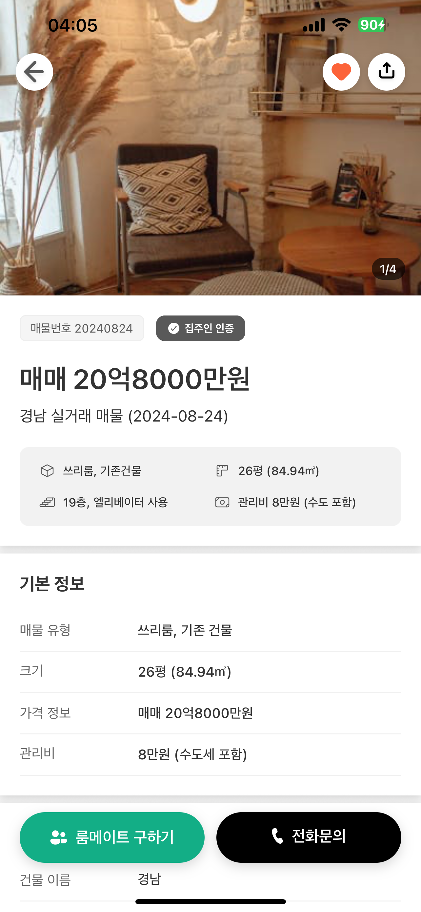
  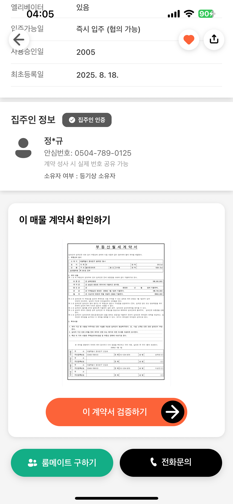
  
</div>

- **실시간 매물 정보**: 최신 원룸, 투룸, 오피스텔, 아파트 정보 제공
- **상세 매물 보기**: 풍부한 이미지와 상세 정보로 매물 파악
- **관심 매물 저장**: 마음에 드는 매물을 북마크하여 쉽게 관리
- **매물 공유 기능**: SNS나 채팅으로 매물 정보 간편 공유

### 🗺️ 지도 기반 탐색
<div align="center">
  
  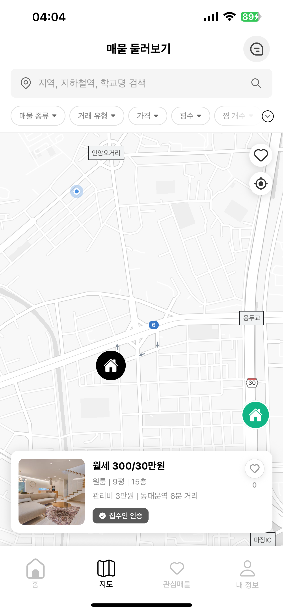
</div>

- **직관적인 위치 검색**: Google Maps 기반 실시간 매물 위치 표시
- **상세 필터링**: 가격, 면적, 교통, 옵션별 맞춤 검색
- **주변 정보**: 대학교, 지하철역, 편의시설 거리 정보 제공

### 👥 AI 룸메이트 매칭
<div align="center">
  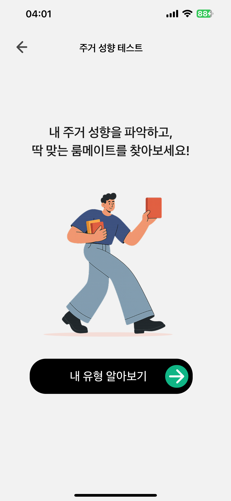
  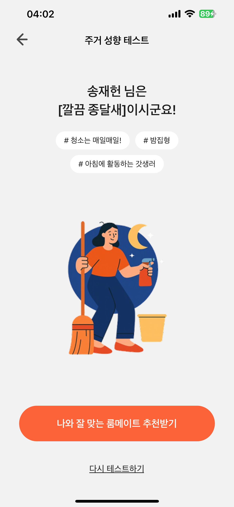
  
</div>

- **성향 분석 테스트**: 생활 패턴, 청소 습관, 수면 패턴 등 다양한 요소 분석
- **맞춤형 추천**: AI 알고리즘을 통한 최적의 룸메이트 매칭
- **매칭률 표시**: 나와의 궁합도를 퍼센트로 확인
- **안전한 연결**: 대학교 이메일 인증을 통한 신뢰할 수 있는 매칭

### 💬 실시간 채팅
<div align="center">
  
  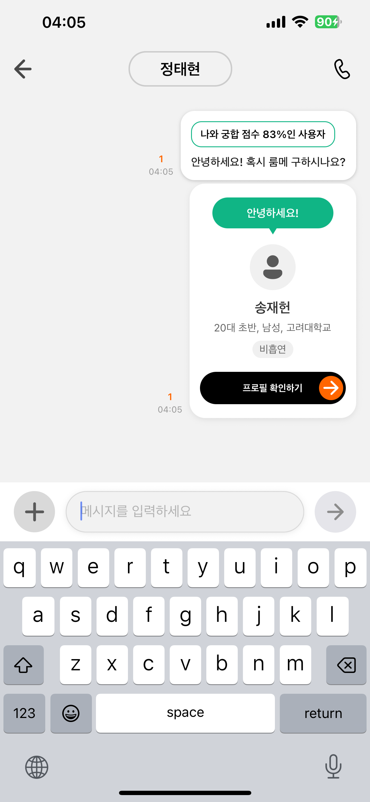
  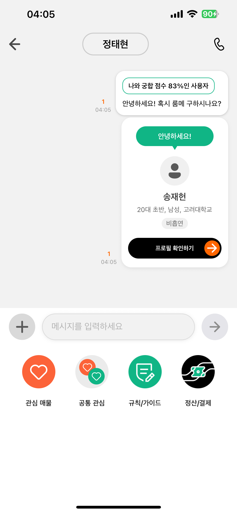
</div>

- **매물 공유**: 채팅창에서 바로 매물 정보 공유
- **빠른 액션**: 규칙/가이드, 정산/결제 등 편의 기능
- **안전한 소통**: 본인 인증 완료된 사용자들과의 안전한 대화
- **채팅 관리**: 차단, 신고 등 안전 기능 제공

### 🤖 AI 정책 챗봇
<div align="center">
  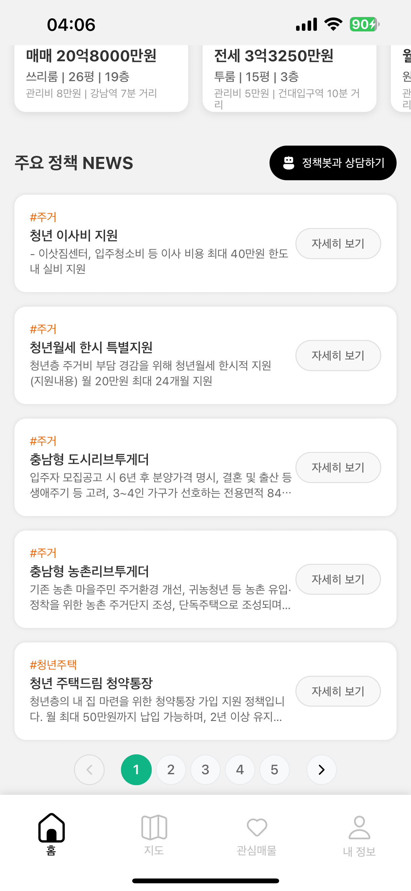
  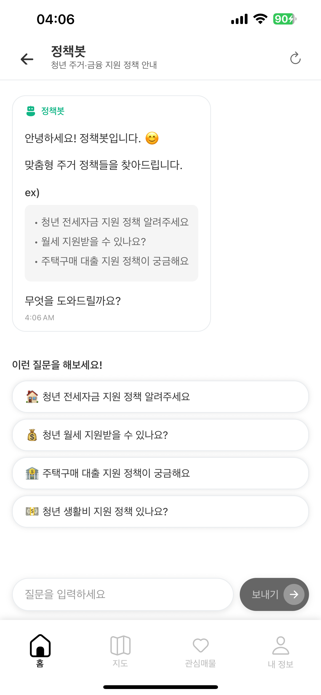
  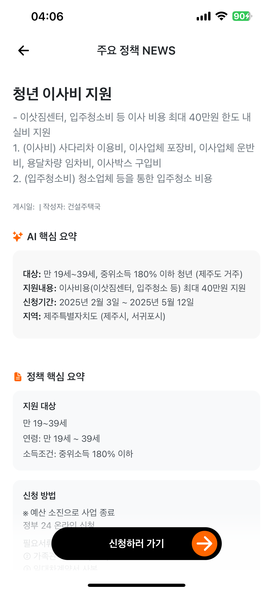
</div>

- **맞춤형 정책 안내**: 청년 주택 정책, 전세 대출 등 개인별 추천
- **실시간 AI 상담**: 복잡한 부동산 정책을 쉽게 설명
- **최신 정보**: 정부 정책 업데이트 실시간 반영
- **정책 상세보기**: 신청 방법, 조건 등 자세한 정보 제공

### 📋 계약서 AI 분석
<div align="center">
  
  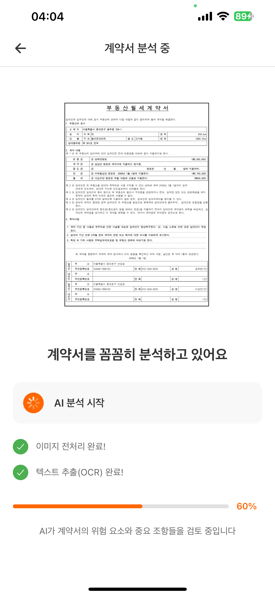
  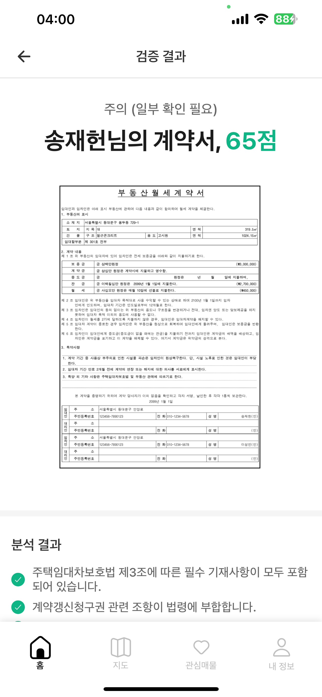
</div>

- **위험 조항 탐지**: AI가 계약서의 불리한 조항 자동 분석
- **체크리스트 제공**: 놓치기 쉬운 중요 사항 확인
- **법적 조언**: 전문가 수준의 계약서 검토 서비스
- **분석 리포트**: 상세한 계약서 분석 결과 제공

### 🏠 매물 찾기 도우미
<div align="center">
  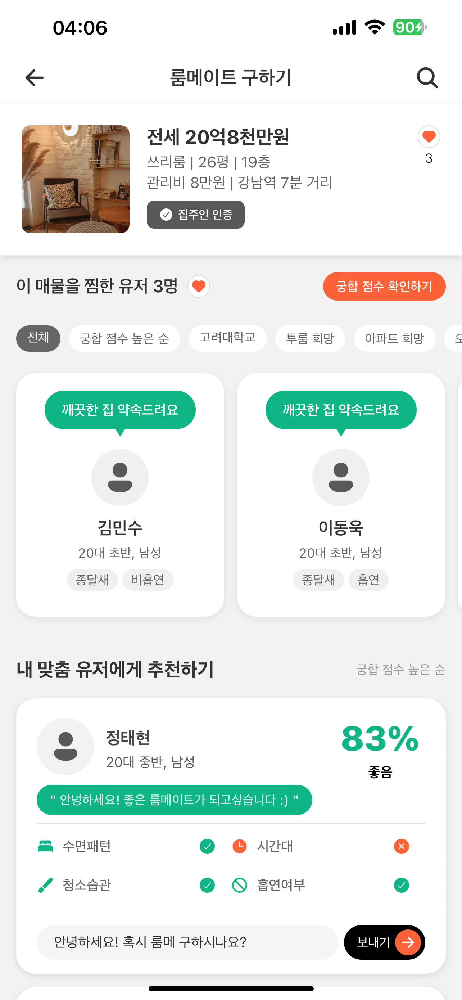
  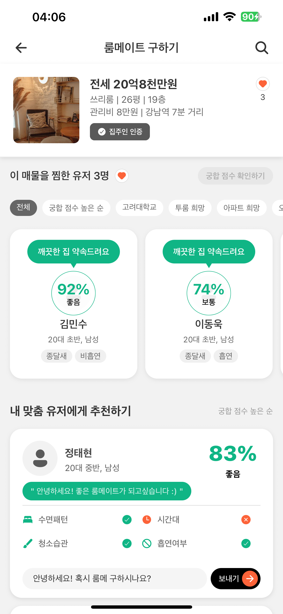
</div>

- **함께 찾기**: 룸메이트와 함께 매물을 찾는 기능
- **조건 공유**: 서로의 조건을 맞춰 최적의 매물 추천
- **공동 관심 목록**: 둘 다 관심 있는 매물 자동 필터링

### 📱 기본 앱 기능
<div align="center">
  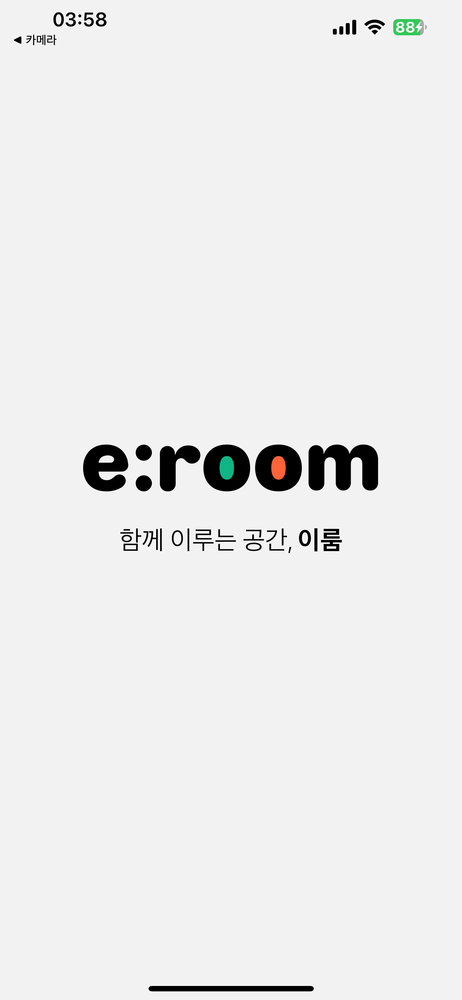
  
  
  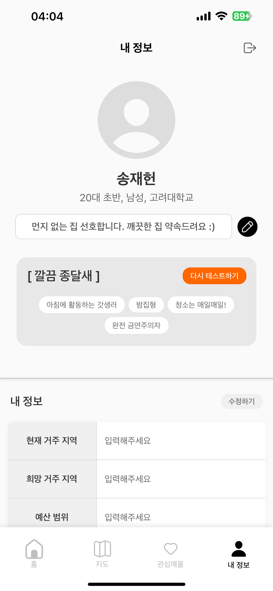
</div>

- **직관적인 UI/UX**: 깔끔하고 사용하기 쉬운 인터페이스
- **개인 정보 관리**: 프로필, 관심사, 매칭 기록 관리
- **다양한 로그인 방식**: 이메일, 소셜 로그인 지원

## 🏗️ 기술 스택

### Frontend (React Native + Expo)
- **React Native 0.79.5**: 크로스 플랫폼 모바일 앱 개발
- **Expo 53.0.22**: 빠른 개발과 배포를 위한 플랫폼
- **React Navigation**: 네비게이션 관리
- **AsyncStorage**: 로컬 데이터 저장
- **React Native Maps**: 지도 기능 구현
- **React Native Web**: 웹 플랫폼 지원
- **Expo EAS**: 앱 빌드 및 배포 자동화

### Backend (FastAPI + Python)
- **FastAPI**: 고성능 웹 API 프레임워크
- **SQLAlchemy**: ORM을 통한 데이터베이스 관리
- **PyJWT 2.8.0**: 안전한 사용자 인증
- **Pydantic**: 데이터 검증 및 직렬화
- **Uvicorn**: ASGI 서버

### AI & Data
- **OpenAI API**: GPT를 활용한 자연어 처리
- **Gemini API**: Google의 AI 모델 활용
- **FAISS**: 벡터 유사도 검색
- **OCR**: 계약서 텍스트 추출
- **크롤링**: 실시간 매물/정책 데이터 수집

### Database & Storage
- **SQLite**: 경량 관계형 데이터베이스
- **Vector Database**: AI 임베딩 저장소


## 🚀 설치 및 실행

### 필수 요구사항
- Node.js 18.x 이상
- Python 3.8 이상
- Git
- Expo Go 앱 (모바일 테스트용)

### 설치 방법

1. **저장소 클론**
```bash
git clone https://github.com/Songjaeheon0923/Uni-con.git
cd Uni-con
```

2. **백엔드 설정**
```bash
cd backend
pip install -r requirements.txt
cp .env.example .env
# .env 파일에서 API 키 설정
python main.py  # 서버가 http://localhost:8080 에서 실행됩니다
```

3. **프론트엔드 설정**
```bash
cd frontend-react-native
npm install
cp .env.example .env
# .env 파일에서 EXPO_PUBLIC_API_BASE_URL을 실제 IP 주소로 설정
# 예: EXPO_PUBLIC_API_BASE_URL=http://192.168.1.100:8080
npx expo start
```

4. **앱 실행**
- **모바일**: Expo Go 앱을 설치하고 QR 코드 스캔
- **웹**: `w` 키를 눌러 웹 브라우저에서 실행
- **Android**: `a` 키를 눌러 Android 에뮬레이터에서 실행
- **iOS**: `i` 키를 눌러 iOS 시뮬레이터에서 실행 (Mac only)

### 빌드 및 배포

**APK 빌드**
```bash
cd frontend-react-native
eas build --platform android --profile production-apk
```

**웹 배포**
```bash
cd frontend-react-native
npm run build
npm run serve
```

## 📁 프로젝트 구조

```
Uni-con/
├── 📱 frontend-react-native/        # React Native 앱
│   ├── src/
│   │   ├── components/             # 재사용 컴포넌트
│   │   ├── screens/               # 화면 컴포넌트
│   │   ├── contexts/              # React Context
│   │   ├── services/              # API 통신
│   │   └── utils/                 # 유틸리티 함수
│   └── assets/                    # 이미지, 아이콘 등
├── 🖥️ backend/                     # FastAPI 서버
│   ├── auth/                      # 인증 관리
│   ├── database/                  # DB 연결 및 설정
│   ├── models/                    # 데이터 모델
│   ├── routers/                   # API 라우터
│   ├── ai/                        # AI 관련 모듈
│   ├── crawlers/                  # 데이터 크롤링
│   └── utils/                     # 백엔드 유틸리티
└── 📚 docs/                        # 문서
```

## 📱 주요 화면

### 회원가입 & 인증
- 📧 이메일 인증
- 📱 휴대폰 인증 (MVP: 0000 입력으로 테스트)
- 🆔 신분증 인증 (실제 로직 x)
- 🎓 학교 이메일 인증(MVP: 0000 입력으로 테스트)

### 메인 기능
- 🏠 매물 검색 및 상세보기
- 🗺️ 지도 기반 매물 탐색 (Google Maps API)
- 👥 룸메이트 추천 및 매칭
- 💬 실시간 채팅
- 📋 계약서 분석

## 🔧 개발 가이드

### 브랜치 전략
- `main`: 프로덕션 배포용
- `develop`: 개발 통합 브랜치
- `web-version-improvements`: 웹 버전 개선 작업

### 테스트 계정
```
이메일: testuser@example.com
비밀번호: testpass
```

### 환경 변수 설정

**Backend (.env)**
```env
DATABASE_URL=sqlite:///./users.db
SECRET_KEY=your-secret-key
ALGORITHM=HS256
ACCESS_TOKEN_EXPIRE_MINUTES=30
```

**Frontend (.env)**
```env
EXPO_PUBLIC_API_BASE_URL=http://your-ip:8080
EXPO_PUBLIC_GOOGLE_MAPS_API_KEY=your-google-maps-key
```


## 👥 Team

- **이성민** - *PM & Developer* - [@danlee-dev](https://github.com/danlee-dev)
- **송재헌** - *Developer* - [@Songjaeheon0923](https://github.com/Songjaeheon0923)
- **문유빈** - *Designer*


<div align="center">
  <p>© 2025 Uni-con Team. All rights reserved.</p>
</div>